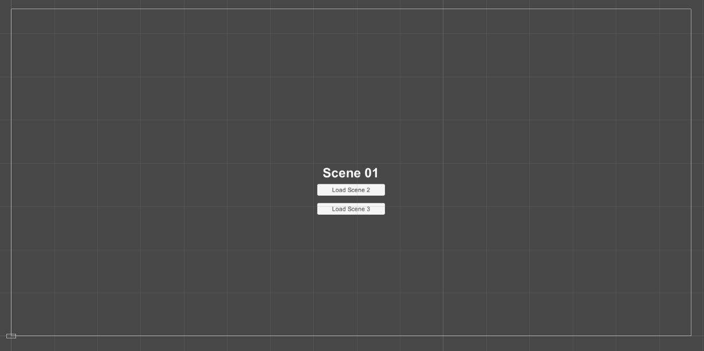
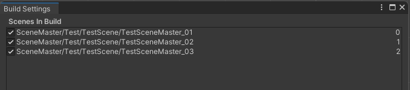
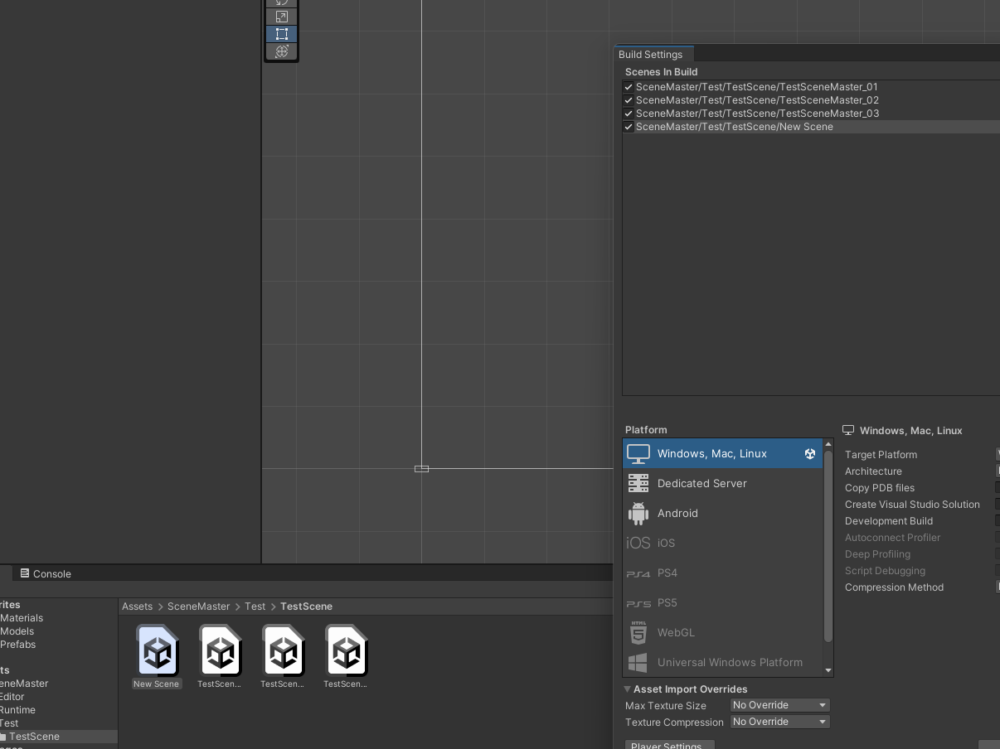
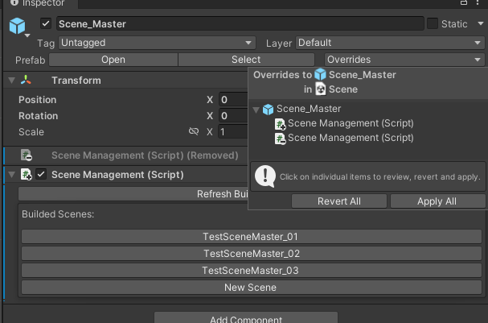
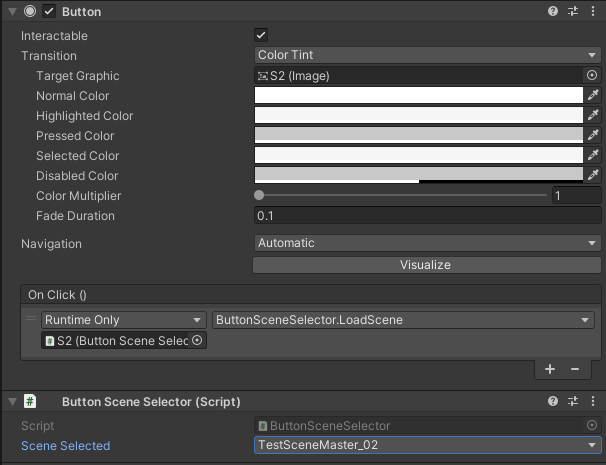
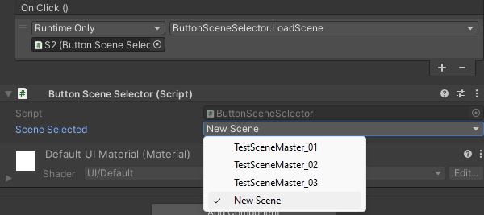
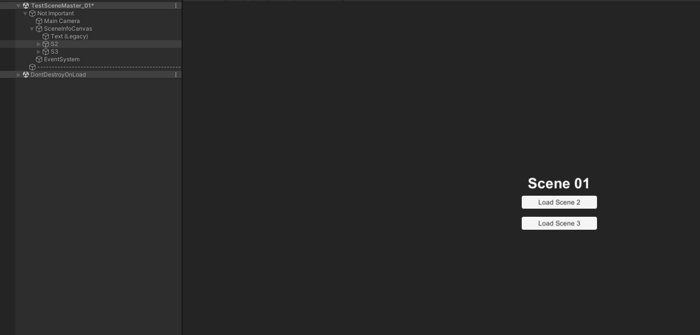
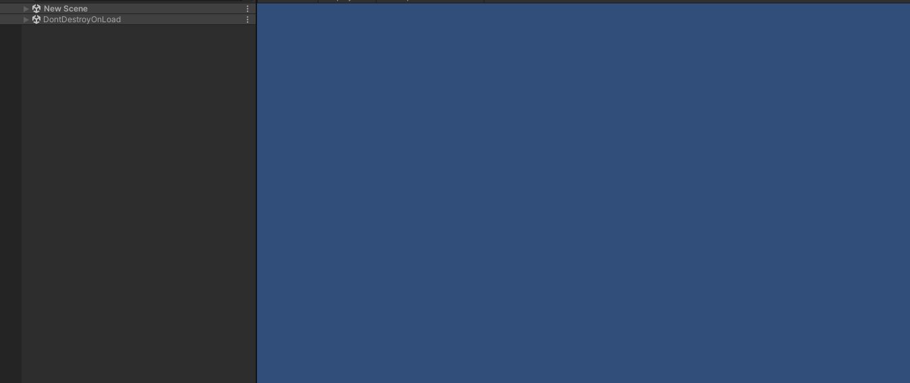

# Scene Master

---

<aside>
💡 A simple but super powerful scene manager / loader with a very helpful editor for quickly load scenes from editor mode.

</aside>

# **Overview**

This tool focuses on a very specific part of video game development. When you need to load a scene, in play mode and editor mode. With a simple script for manage the scenes, and a button scene loader script to attach to any button for load specific scenes.

- We have created the ultimate tool for load scenes.

- Load your scenes in play mode and editor mode with two simple scripts for manage everything.

- No need for code, just add the scripts and manage your scenes.

- A simple and intuitive interface for manage your scenes, load them and refresh them in case of new scenes are loaded.

- Enjoy this tool in any kind of project, with all the necessary documentation, and several test scenes, so you can get used to it, and see in which ways it could be useful for you.

Scene Master has been created with the purpose of helping developers to manage their scenes on the projects.

# **Practical Examples**

Okay so now let's see how to use Scene Master in the Unity.

So first of all let's import the package from the asset store. Import everything for the test, and in the folders we have the json package with the version information, etc, the pdf with this documentation, and the three main folders with the editor scripts, the runtime scripts with all the important files, and finally the test folder with our scenes examples, so first load the test scene 1.

ok now we can open the scene master prefab on the scene, and as you can see it's just a prefab with our scene management script prepared, but in your project you can't use this feature until you first add these three scenes to your build settings.

When you have this done, go back to the scene master, and now you can press the buttons, and you will see how the scenes are loading in editor mode, this is in my opinion a time saver.

Now imagine you want to add another scene, so just create a new one, and now we have to add it to the build settings so the tool can refresh it.

For the scene master to update your scenes correctly we have to first open the prefab, remove the script and add it again for the prefab to detect the change, or you can simply do the same and override the prefab.

So now you have access to your scene with a simple interface.

Okay so that's all for the loading part of the scene editor, and now we're going to see these buttons on the actual scenes, and here we have the script of the button scene selector, with our scenes selected, so in the "on click" event we just need to add the script loading method.

We can change this for the new scene we just created and let's test it in play mode, so here you can see how the tool loads the scene.

So here in play mode you can see the result. It's as simple as that.

That's all for now, enjoy the tool :)

- * For more information, take a look at the tutorial in the [asset store](https://assetstore.unity.com/publishers/55193) or on our YouTube channel ([BabelGames](https://www.youtube.com/channel/UCNsBWiGXJSE2ZTOKv5o-c2Q)) *.